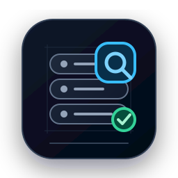
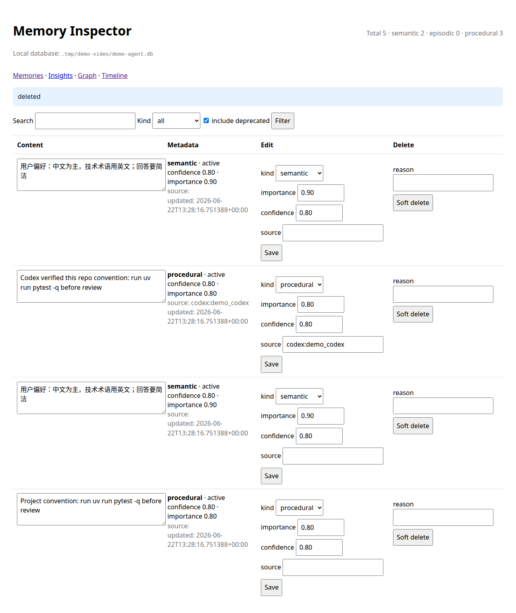
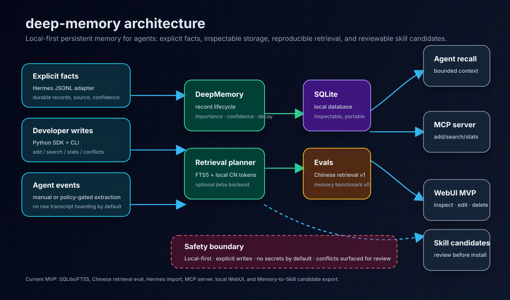

<p align="center">
  
</p>

<h1 align="center">deep-memory</h1>

<p align="center"><em>It remembers the thing you approved. Everything else has to earn the right.</em></p>

<div align="center">

  <p><strong>A local memory notebook for agents that forget too much, remember too much, and rarely ask permission.</strong></p>

  <p>
    <code>deep-memory</code> is the memory layer I wanted while wiring real agents together: boring SQLite on this machine,
    explicit durable facts and reusable procedures, scoped recall, and a delete button that actually means delete.
    No hidden cloud state. No transcript hoarding. No mysterious "memory" you have to trust because the UI says so.
  </p>

  <p>
    <a href="README.md">English</a> ·
    <a href="README.zh-CN.md">简体中文</a>
  </p>

  <p>
    <a href="https://github.com/benbenlijie/deep-memory/actions/workflows/ci.yml"></a>
    
    
    
  </p>

  <p><strong>75/75 Chinese retrieval evals · 20/20 bilingual memory tasks · local SQLite · explicit writes · scoped recall</strong></p>

  <p>
    <a href="#quickstart">Quickstart</a> ·
    <a href="docs/AGENT_INSTALL_GUIDE.md">Agent install guide</a> ·
    <a href="#talk-to-your-agent">Talk to your agent</a> ·
    <a href="#connect-your-agent">Connect your agent</a> ·
    <a href="#evidence-not-magic">Benchmarks & evals</a> ·
    <a href="docs/SAFETY_AND_PRIVACY.md">Safety & privacy</a>
  </p>
</div>

---

You know the feeling. The agent confidently forgets the rule you gave it yesterday. Then, somehow, it remembers a half-wrong preference from three experiments ago and drags it into a new repo.

`deep-memory` is for people who like agents, but do not want agent memory to become folklore.

## Choose the path that fits what you need

| If you are... | Start here | What you get |
| --- | --- | --- |
| An agent operator who wants the fastest install | [Quickstart](#quickstart) | A machine-local database, one test memory, and a successful retrieval |
| An AI agent installing this for a user | [Talk to your agent](#talk-to-your-agent) | A direct task prompt plus a verification checklist |
| Connecting Claude Code, Hermes, Codex, or OpenCode | [Connect your agent](#connect-your-agent) | MCP or wrapper setup against one shared local DB |
| Evaluating whether the claims are real | [Evidence, not magic](#evidence-not-magic) | Checked-in evals, benchmark baselines, and reproduction commands |
| Checking the safety boundary before rollout | [Safety boundary](#safety-boundary) | Explicit write rules, scope boundaries, and destructive controls |
| Inspecting how the system is built | [Architecture](#architecture) | Mechanism, storage model, retrieval path, and extension surface |

## Before / after

Without a shared memory layer, every agent has the same bad habit: it either forgets the thing you explained yesterday, or it remembers something somewhere you cannot inspect. You repeat preferences, repo conventions, safety rules, and all the tiny "please don't do that again" corrections. Then next week you still have no idea what stuck.

With `deep-memory`, a useful convention becomes a scoped, reviewable record:

```text
project:deep-memory  procedural  "Run uv run pytest -q before review"
user:ben             semantic    "User prefers concise answers with English technical terms"
```

Claude Code, Codex, OpenCode, and Hermes can pull the same bounded context before work. You can inspect it in the CLI or local WebUI, edit it, export it, soft-delete it, or hard-delete it when a memory should stop steering future behavior.

## Why this exists

I do not want agents to become more "personalized" by quietly accumulating invisible state. That is just a new place for bugs to hide.

I want memory to behave like infrastructure: local by default, inspectable when something feels off, scoped narrowly enough to avoid leaking context between projects, and testable enough that "supports Chinese" means an eval passed, not a badge on a README.

Most agent memory fails in one of two ways: it forgets everything useful between sessions, or it remembers too much in a place the user cannot inspect. Both are bad substrates for serious work.

`deep-memory` is built around a narrower mechanism:

- **Cross-agent continuity.** One shared memory layer for Claude Code, Codex, OpenCode, and Hermes, so useful conventions do not have to be re-taught from scratch.
- **Inspectable by default.** Read, edit, export, soft-delete, hard-delete, and audit records through the CLI, Python SDK, or local WebUI.
- **Machine-local governance.** One local SQLite store can be shared across agents, while `scope` and `scope_id` keep records bounded to global, user, tenant, workspace, or project namespaces.
- **Chinese retrieval as a first-class path.** FTS5 plus local Chinese/English token fallback, optional `jieba`, and checked-in Chinese retrieval fixtures make the claim measurable instead of decorative.
- **Memory to skill candidate export.** Procedural memory can be exported as reviewable skill candidates, so successful workflows become auditable artifacts instead of silently turning into behavior rules.
- **Regression-tested retrieval.** Checked-in evals cover Chinese retrieval, bilingual memory/no-memory tasks, and the core CLI/SDK behavior.

Persistent agent memory is powerful precisely because it changes future behavior. `deep-memory` keeps the mechanism narrow: store durable facts and reusable procedures, keep them local and inspectable, retrieve only relevant context, and make deletion and policy boundaries explicit.

## How it works

Before an agent relies on memory, it walks a short governance path:

```text
1. Is this durable?        → no: do not store it
2. Is it safe to retain?   → secrets / raw private transcripts / temporary status are denied
3. What scope is narrowest?→ project, workspace, user, tenant, or global
4. Can a human inspect it? → CLI, Python SDK, local WebUI, export, audit
5. Is it still useful?     → edit, deprecate, resolve conflict, or delete
6. Is it procedural?       → export as a reviewable skill candidate, not an auto-installed rule
```

That control surface matters because a useful memory layer needs more than storage:

- **Inspectability.** Humans should be able to see what an agent will carry forward.
- **Deletion.** Wrong, stale, private, or unsafe records must be removable, not merely hidden by ranking.
- **Scoping.** Machine-level memory should stay relevant through fixed scopes plus explicit namespace IDs.
- **Regression tests.** Retrieval quality and safety boundaries should be checked with fixtures, not asserted in copy.

## Screenshots

<p align="center">
  
</p>

## Architecture

<p align="center">
  
</p>

## Quickstart

If you want the fastest path, ask your coding agent:

> Install deep-memory for this machine, set it up as a shared memory layer across my agent tools, and verify that you can write and retrieve a durable memory.

Agent checklist:
1. Read [`docs/AGENT_INSTALL_GUIDE.md`](docs/AGENT_INSTALL_GUIDE.md).
2. Install dependencies and initialize a machine-local memory store.
3. Connect your agent through MCP or a wrapper.
4. Verify that one durable memory can be written and retrieved.
5. Report which scopes you configured (for example: global, workspace, or project).

### Prerequisites

- Python 3.10–3.12 (`requires-python = >=3.10,<3.13` in `pyproject.toml`)
- [`uv`](https://docs.astral.sh/uv/) for environment sync and command execution
- Package/release maintainers: see [`docs/PACKAGING.md`](docs/PACKAGING.md) for the wheel, uv tool, GitHub Release, and PyPI readiness checklist.
- Optional extras depending on what you want:
  - `dev`: pytest + ruff for local verification
  - `mcp`: the `deep-memory-mcp` server for MCP-native agent integrations
  - `retrieval`: optional `jieba` tokenizer for higher-fidelity Chinese segmentation

Install `uv` if you do not already have it:

```bash
curl -LsSf https://astral.sh/uv/install.sh | sh
```

If a non-interactive agent shell still says `uv: command not found`, check where the installer placed it and export that directory for the current task:

```bash
command -v uv || ls -l ~/.local/bin/uv ~/.cargo/bin/uv 2>/dev/null
export PATH="$HOME/.local/bin:$HOME/.cargo/bin:$PATH"
```

### Zero-config first run

If you just want to prove the mechanism works before wiring any agent, this path gives you one local DB, one durable memory, and one retrieval roundtrip:

```bash
uv sync --extra dev --extra mcp
uv run deep-memory verify-install ~/.deep-memory/deep-memory.db --json
uv run deep-memory add ~/.deep-memory/deep-memory.db \
  "User wants agents to use deep-memory as shared persistent memory" \
  --kind semantic \
  --scope project \
  --scope-id deep-memory \
  --importance 0.8
uv run deep-memory search ~/.deep-memory/deep-memory.db "shared persistent memory" \
  --scope project \
  --scope-id deep-memory
```

Expected CLI shape:

```text
$ uv run deep-memory search ~/.deep-memory/deep-memory.db "shared persistent memory" --scope project --scope-id deep-memory
score=...  scope=project  scope_id=deep-memory  kind=semantic  content=User wants agents to use deep-memory as shared persistent memory
```

This is the core loop: install one machine-local memory store, let agents share it, and keep records bounded with a fixed `scope` plus a custom `scope_id`.

If you are an AI agent installing this for a user, follow [`docs/AGENT_INSTALL_GUIDE.md`](docs/AGENT_INSTALL_GUIDE.md) — it covers MCP setup, wrappers, safe memory-write rules, scope policy, and success reporting.

## Talk to your agent

If you prefer a direct handoff, copy one of these prompts.

### Fastest installation prompt

> Install deep-memory for this machine, connect it to my agent tools through MCP or a wrapper, and verify that you can write and retrieve one durable memory. Tell me which scope layout you chose and why.

### Shared-agent rollout prompt

> Set up deep-memory as a shared machine-local memory layer for Claude Code, Codex, OpenCode, and Hermes. Use the same SQLite database for every tool, keep memory writes explicit, and show me the exact retrieval test you ran.

### Safety-first evaluation prompt

> Evaluate whether deep-memory fits my workflow. Check the safety boundary, scoping model, deletion path, and benchmark evidence before you install anything, then recommend a rollout plan.

### Project-scope memory prompt

> Connect deep-memory to this repo and keep retrieval bounded to project scope. Before work, search for this repository's conventions; after verified success, write back only durable project-specific facts or procedures and show me the exact records you added.

### Procedural-memory-to-skill prompt

> Use deep-memory to capture one successful workflow from this task as procedural memory, then export it as a reviewable skill candidate instead of auto-installing it. Show me the exported artifact and explain why it should stay review-first.

## Evidence, not magic

These checks are intentionally modest. They are internal evals and regressions, not a claim that memory is solved.

| Evaluation | Current checked-in result | Reproduce |
| --- | --- | --- |
| Chinese retrieval v1 | 55/55 with the default local backend; 55/55 with optional `jieba`; earlier plain SQLite FTS baseline was 24/55 | `uv run python evals/chinese_retrieval_eval.py --data evals/data/zh_memory_retrieval.jsonl` |
| Chinese retrieval v2 | 20/20 harder multi-memory cases with distractors; local top-1 accuracy 1.0 and MRR 1.0 in this checked-in baseline | `uv run python evals/chinese_retrieval_eval.py --data evals/data/zh_memory_retrieval_v2.jsonl --json` |
| Memory benchmark v0 | 20 bilingual tasks; no-memory baseline 0/20; `deep-memory` should pass at least 16/20 in tests and usually 20/20 with the default retrieval limit | `uv run python benchmarks/memory_benchmark.py` |
| Test suite | Core behavior, policy, import/export, CLI paths, and regressions are covered by pytest and CI | `uv run pytest -q` |

Details: [`docs/CHINESE_RETRIEVAL_EVAL.md`](docs/CHINESE_RETRIEVAL_EVAL.md), [`docs/MEMORY_BENCHMARK.md`](docs/MEMORY_BENCHMARK.md).

## Connect your agent

Use MCP when your agent supports it. Use a wrapper when it does not. Either way, point every tool at the same machine-local database and rely on `scope` / `scope_id` to keep recall bounded:

```text
~/.deep-memory/deep-memory.db
```

This README is only the routing layer. The complete install contract lives in [`docs/AGENT_INSTALL_GUIDE.md`](docs/AGENT_INSTALL_GUIDE.md) and [`docs/agent-install.json`](docs/agent-install.json); per-runtime commands and verification status live in [`docs/AGENT_QUICKSTART_MATRIX.md`](docs/AGENT_QUICKSTART_MATRIX.md); adapter permissions and risk boundaries live in [`docs/ADAPTERS.md`](docs/ADAPTERS.md).

Common config generators:

```bash
deep-memory mcp-config --agent claude --db ~/.deep-memory/deep-memory.db
deep-memory mcp-config --agent hermes --db ~/.deep-memory/deep-memory.db
deep-memory mcp-config --agent generic --db ~/.deep-memory/deep-memory.db --json
```

| Agent | Start here | What is authoritative there |
| --- | --- | --- |
| Claude Code | [`docs/AGENT_QUICKSTART_MATRIX.md#claude-code`](docs/AGENT_QUICKSTART_MATRIX.md#claude-code) | MCP command, `CLAUDE.md` policy note, smoke command |
| Hermes | [`docs/AGENT_QUICKSTART_MATRIX.md#hermes`](docs/AGENT_QUICKSTART_MATRIX.md#hermes) | `config.yaml` shape, profile boundary, JSONL import fallback |
| Codex | [`docs/AGENT_QUICKSTART_MATRIX.md#codex-wrapper`](docs/AGENT_QUICKSTART_MATRIX.md#codex-wrapper) | wrapper command, facts-out JSONL contract, pending runtime caveats |
| OpenCode / OpenClaw-style tools | [`docs/AGENT_QUICKSTART_MATRIX.md#opencode--openclaw-style-wrapper`](docs/AGENT_QUICKSTART_MATRIX.md#opencode--openclaw-style-wrapper) | wrapper pattern, explicit-write policy, smoke command |

For protocol-level MCP smoke evidence, see [`docs/MCP_INTEROPERABILITY.md`](docs/MCP_INTEROPERABILITY.md).

## Memory scopes

`deep-memory` is machine-local by default, but records can still be bounded explicitly:

| Scope | Primary use | Typical content | Cross-project? |
| --- | --- | --- | --- |
| `global` | Long-lived facts that should follow the whole machine | durable user preferences, stable conventions, machine-level policy | Yes |
| `user` | Per-user partitioning on shared hosts | one person's preferences, role, language, recurring workflow habits | Sometimes |
| `workspace` | Shared context across related repos or folders | adjacent project notes, shared build/test conventions, multi-repo context | Sometimes |
| `project` | Repo-specific memory | repository conventions, local architecture facts, review checklists | No |
| `tenant` | Team / environment isolation | org lane separation, staging vs production boundaries, multi-tenant execution state | Depends on tenant design |

The database is shared; `scope` is the fixed governance layer (`global`, `user`, `tenant`, `workspace`, or `project`) and `scope_id` is the custom namespace inside that layer, such as `deep-memory`, `repo-a`, or `ben`. Start with the narrowest scope that preserves the behavior you want, then widen only when the memory should truly travel across projects or agents.

## Inspect memory

```bash
uv run deep-memory webui ~/.deep-memory/deep-memory.db --host 127.0.0.1 --port 8765
# open http://127.0.0.1:8765
```

`deep-memory webui ...` is the supported launch path. `deep-memory-webui` is not the current console script or launch contract.

The WebUI can list, search, edit, and soft-delete records. It binds to `127.0.0.1` by default, now serves `/favicon.svg` and `/favicon.ico`, and uses the same project icon in the browser tab. If port `8765` is already occupied, choose another free port with `--port`, for example `--port 8876`.

Export and audit:

```bash
uv run deep-memory export ~/.deep-memory/deep-memory.db                      # active records only
uv run deep-memory export ~/.deep-memory/deep-memory.db --include-deprecated # audit / backup
uv run deep-memory hard-delete ~/.deep-memory/deep-memory.db <memory-id>     # physically remove one record
```

## Python API

```python
from pathlib import Path
from deep_memory import DeepMemory

mem = DeepMemory(Path("~/.deep-memory/deep-memory.db").expanduser())
mem.add(
    "User prefers concise answers with English technical terms",
    kind="semantic",
    importance=0.9,
    scope="user",
    scope_id="ben",
)
mem.add(
    "Project convention: use uv for tests",
    kind="procedural",
    importance=0.8,
    scope="project",
    scope_id="deep-memory",
)

for result in mem.search(
    "how should this repo be tested?",
    scope="project",
    scope_id="deep-memory",
    limit=3,
):
    print(result.score, result.record.kind, result.record.content)
```

## What works today

| Area | Status | Notes |
| --- | --- | --- |
| Local persistence | Implemented | Machine-local SQLite DB controlled by the user, with fixed global/user/tenant/workspace/project scopes and custom scope IDs. |
| Search | Implemented | FTS5 plus local Chinese/English token fallback. |
| Optional Chinese tokenizer | Implemented | `jieba` backend via `uv sync --extra retrieval`. |
| Metadata | Implemented | `kind`, `importance`, `confidence`, `source`, timestamps, conflict states, scope, and decay. |
| Conflict handling | Implemented | Candidate, resolved, superseded, deprecated. |
| Python SDK + CLI | Implemented | `add`, `search`, `stats`, `conflicts`, `resolve-conflict`, `export`, `hard-delete`, `hermes-import`, `webui`. |
| MCP server | Implemented | Stdio tools for `add`, `search`, `stats`, and conflict helpers. |
| Hermes import | Implemented | Explicit session facts JSONL to `deep-memory` records. |
| Local WebUI MVP | Implemented | Inspect, search, edit, soft-delete, and favicon-backed browser identity for memory records. |
| Memory to skill candidate | Implemented | Exports procedural memories as reviewable skill markdown; no auto-install. |
| Codex wrapper MVP | Implemented | `deep-memory codex-run` injects bounded context and imports only explicit `--facts-out` JSONL after success. |
| Native adapters for every agent | Spec / prototype | Use MCP or wrapper first. See `docs/ADAPTERS.md`. |
| Vector retrieval / hosted sync | Roadmap | Later, if evals and privacy boundaries justify it. |

## Architecture

The core system is small on purpose:

1. agents or developers produce explicit facts, procedures, and durable conventions;
2. SDK, CLI, MCP, or wrapper paths validate and write records;
3. machine-local SQLite + FTS5 stores searchable memory with metadata and scope;
4. future agents retrieve a bounded context block before work;
5. humans inspect, edit, export, delete, evaluate, or promote procedural records into skill candidates.

SQLite is boring on purpose. It is easy to install, inspect, test, back up, and replace later. A single machine-local store keeps agents interoperable; scopes keep retrieval bounded. Vector retrieval stays on the roadmap with schema placeholders and an opt-in migration path; see [`docs/VECTOR_ROADMAP.md`](docs/VECTOR_ROADMAP.md).

<details>
<summary>Read more architecture and policy docs</summary>

- [`docs/ARCHITECTURE.md`](docs/ARCHITECTURE.md)
- [`docs/SAFETY_AND_PRIVACY.md`](docs/SAFETY_AND_PRIVACY.md)
- [`docs/MEMORY_POLICY.md`](docs/MEMORY_POLICY.md)
- [`docs/MCP_INTEROPERABILITY.md`](docs/MCP_INTEROPERABILITY.md)
- [`docs/ADAPTERS.md`](docs/ADAPTERS.md)
- [`docs/ROADMAP.md`](docs/ROADMAP.md)
- [`docs/VECTOR_ROADMAP.md`](docs/VECTOR_ROADMAP.md)

</details>

## Safety boundary

Persistent memory changes future behavior. Keep the default narrow:

- store explicit durable facts, not raw transcripts;
- use machine-local SQLite by default;
- keep `scope` as the fixed layer and `scope_id` as the custom namespace so global memories are intentional and project/workspace memories stay bounded;
- retrieve a small relevant context block;
- retrieval telemetry is local-only and can be disabled with `DEEP_MEMORY_TELEMETRY=off` — see [`docs/SAFETY_AND_PRIVACY.md`](docs/SAFETY_AND_PRIVACY.md);
- never store secrets, private keys, auth cookies, raw credentials, raw private transcripts, or temporary task status;
- write procedural memories only after tests, review, or user confirmation;
- auto-backup destructive operations with a configurable 7-day TTL;
- export skill candidates for review instead of auto-installing them.

Read [`docs/MEMORY_POLICY.md`](docs/MEMORY_POLICY.md) for the allow / deny / requires-confirmation write policy, and [`docs/SAFETY_AND_PRIVACY.md`](docs/SAFETY_AND_PRIVACY.md) before adding automatic writes or shared team memory.

## Contributing

This is a controlled preview lane, not a broad launch claim. Keep contributions small, verified, and aligned with the memory-governance model.

Start here:

- [`CONTRIBUTING.md`](CONTRIBUTING.md) — contributor workflow and review expectations.
- [`docs/COMMUNITY.md`](docs/COMMUNITY.md) — community architecture and maintainer review checklist.
- [`docs/NEXT_PHASE_BACKLOG.md`](docs/NEXT_PHASE_BACKLOG.md) — the issue-sized backlog and suggested verification commands.

New contributors should pick one narrow lane (`good first issue`, `adapter`, `eval`, `governance`, or `docs`), run the listed commands, and open a small PR with evidence.

## License

deep-memory gives your agents a local memory layer you can inspect and govern.

If this project is useful in your workflow, please consider starring the repo and opening issues or discussions with real deployment feedback.

Contact and feedback:
- GitHub Issues: <https://github.com/benbenlijie/deep-memory/issues>
- GitHub Discussions: <https://github.com/benbenlijie/deep-memory/discussions>

MIT
