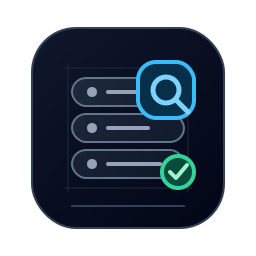
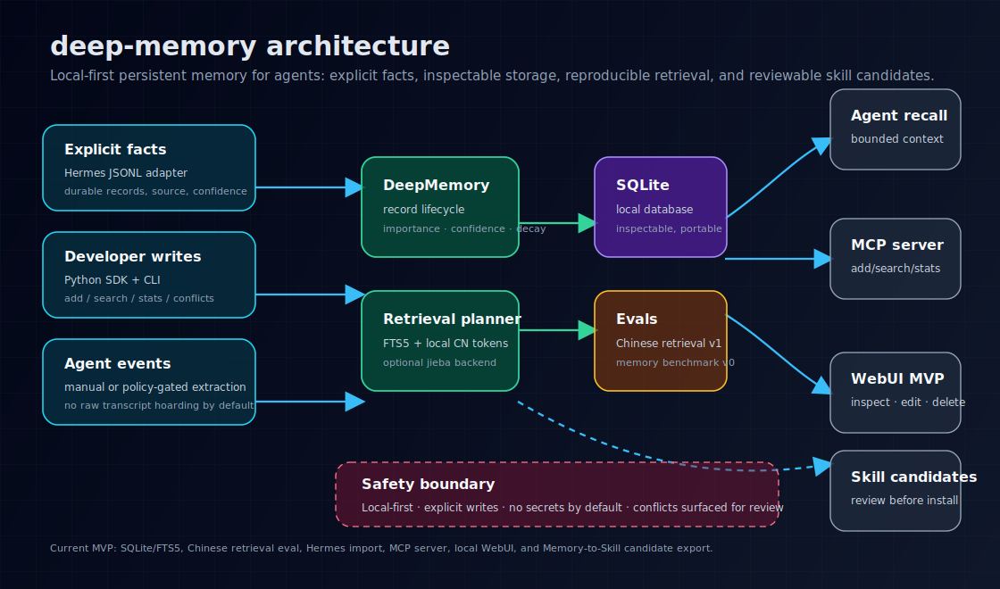
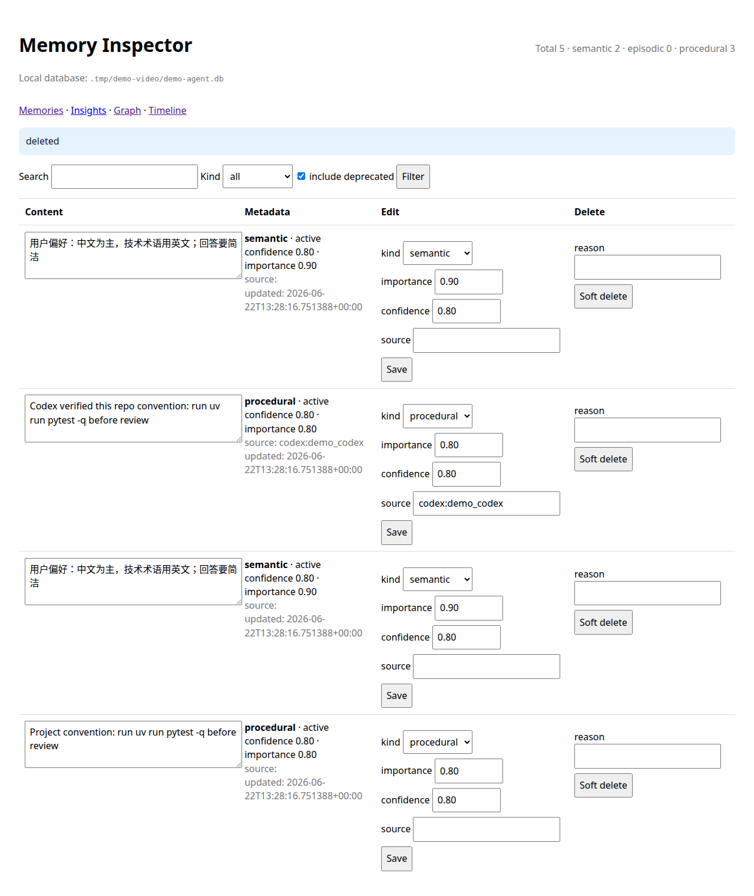

<div align="center">
  

  <p><strong>给你的所有 Agent 一个全机共享、可检查、可治理的本地记忆层。</strong></p>

  <p>
    面向 Claude Code、Codex、OpenCode、Hermes 的共享可检视记忆层。
    把显式的 durable facts 和 reusable procedures 存进一份全机本地的 SQLite 数据库，
    再用 user、workspace、project、workflow、tenant 等 scope 控制边界——
    没有隐藏云状态，不抓 raw transcript，也没有不透明的全局记忆黑盒。
  </p>

  <p>
    <a href="README.md">English</a> ·
    <a href="README.zh-CN.md">简体中文</a>
  </p>

  <p>
    <a href="https://github.com/benbenlijie/deep-memory/actions/workflows/ci.yml"></a>
    
    
    
  </p>

  <p>
    <a href="#快速开始">快速开始</a> ·
    <a href="docs/AGENT_INSTALL_GUIDE.zh-CN.md">Agent 安装指南</a> ·
    <a href="#直接对-agent-说">直接对 Agent 说</a> ·
    <a href="#接入你的-agent">接入你的 Agent</a> ·
    <a href="#评估结果不是魔法">评估结果</a> ·
    <a href="docs/SAFETY_AND_PRIVACY.md">安全与隐私</a>
  </p>
</div>

<p align="center">
  
</p>

<p align="center">
  
</p>

## 按你的目标选入口

| 如果你是... | 从这里开始 | 你会得到什么 |
| --- | --- | --- |
| 想最快装起来的 Agent 使用者 | [快速开始](#快速开始) | 一份全机本地数据库、一条测试记忆，以及一次成功检索 |
| 正在替用户安装的 AI Agent | [直接对 Agent 说](#直接对-agent-说) | 可直接复制的任务提示词和验证清单 |
| 正在接 Claude Code、Hermes、Codex、OpenCode | [接入你的 Agent](#接入你的-agent) | 基于同一份本地 DB 的 MCP / wrapper 接法 |
| 想先判断这些 claim 是不是真的 | [评估结果，不是魔法](#评估结果不是魔法) | checked-in eval、benchmark baseline 和复现命令 |
| rollout 前先看安全边界 | [安全边界](#安全边界) | 显式写入规则、scope 边界与删除控制 |
| 想理解底层机制 | [架构](#架构) | 存储模型、检索路径、机制与扩展面 |

## 为什么需要它

Agent memory 常见的失败模式其实只有两种：要么跨会话之后把有用信息忘光，要么记住了太多东西，但用户根本看不见、删不掉、也不知道它会如何影响之后的行为。两种都不适合严肃工作。

`deep-memory` 选择了一条更窄、也更可验证的路径：

- **跨 Agent 连续性。** Claude Code、Codex、OpenCode、Hermes 共用一层记忆，不用每个工具都从零重新教一遍。
- **默认可检查。** 通过 CLI、Python SDK、本地 WebUI 读取、编辑、导出、软删除、硬删除、审计每一条记录。
- **本地治理。** 一份本机 SQLite 数据库供多个 Agent 共享，再用显式 scope 把记录限制在 user、workspace、project、workflow、tenant 等边界内。
- **中文检索是一等路径。** FTS5 加本地中英文 token fallback，支持可选 `jieba`，并用 checked-in 中文检索 fixture 做衡量，而不是把“支持中文”写成一句文案。
- **Memory to Skill candidate 导出。** procedural memory 可以导出为可审查的 skill candidate，让成功工作流沉淀为 artifact，而不是自动装配成行为规则。
- **有回归测试的检索。** 用 checked-in eval 验证中文检索、bilingual memory/no-memory 任务，以及核心 CLI/SDK 行为，而不是只在文案里宣称“它有效”。

持久记忆真正强大的地方，恰恰在于它会改变未来行为。所以 `deep-memory` 把机制收窄：只存 durable facts 和 reusable procedures；默认本地、可检查；只取回相关上下文；删除、导出、策略边界都要显式。

这层控制面之所以重要，是因为一个真正可用的记忆层不只是“能存东西”：

- **可检查性（Inspectability）。** 人类应该能看到 Agent 会把什么带到下一次任务里。
- **可删除性（Deletion）。** 错误、过时、私密或不安全的记录，必须可以被真正移除，而不是只被排序埋掉。
- **作用域控制（Scoping）。** 全机级记忆必须通过显式的 user、workspace、project、workflow、tenant scope 保持相关性。
- **回归测试（Regression tests）。** 检索质量和安全边界应该用 fixture 持续检查，而不是靠文案断言。

## 快速开始

如果你想走最快路径，直接对你的 coding agent 说：

> 帮我在这台机器上安装 deep-memory，把它设成我多个 Agent 共享的记忆层，并验证你可以写入和取回一条 durable memory。

给 Agent 的执行清单：
1. 先读 [`docs/AGENT_INSTALL_GUIDE.zh-CN.md`](docs/AGENT_INSTALL_GUIDE.zh-CN.md)。
2. 安装依赖并初始化一份全机本地的记忆库。
3. 用 MCP 或 wrapper 把你自己接进去。
4. 验证可以写入并取回一条 durable memory。
5. 向用户说明你配置了哪些 scope（例如 global、workspace、project）。

### 前置依赖

- Python 3.10–3.12（`pyproject.toml` 中声明 `requires-python = >=3.10,<3.13`）
- [`uv`](https://docs.astral.sh/uv/) 用于环境同步和命令执行
- 按需选择 optional extras：
  - `dev`：本地验证所需的 pytest + ruff
  - `mcp`：MCP 原生接入所需的 `deep-memory-mcp` server
  - `retrieval`：更高保真中文分词所需的可选 `jieba`

如果你还没装 `uv`：

```bash
curl -LsSf https://astral.sh/uv/install.sh | sh
```

### 零配置首跑

如果你还不想先接任何 Agent，只想先验证机制，这条路径会给你一份本地 DB、一条 durable memory，以及一次检索回路：

```bash
uv sync --extra dev --extra mcp
uv run deep-memory init ~/.deep-memory/deep-memory.db
uv run deep-memory add ~/.deep-memory/deep-memory.db \
  "用户希望多个 Agent 共享 deep-memory 持久记忆" \
  --kind semantic \
  --importance 0.8
uv run deep-memory search ~/.deep-memory/deep-memory.db "共享 deep-memory 持久记忆"
```

预期 CLI 形态大致如下：

```text
$ uv run deep-memory search ~/.deep-memory/deep-memory.db "共享 deep-memory 持久记忆"
score=...  kind=semantic  scope=global  content=用户希望多个 Agent 共享 deep-memory 持久记忆
```

这个 loop 的重点不是手工敲命令，而是：安装一份全机本地记忆库，让多个 Agent 共享，并通过 scope 保持记录有边界。

如果你是 AI Agent，正在替用户安装或接入这个项目，请看 [`docs/AGENT_INSTALL_GUIDE.zh-CN.md`](docs/AGENT_INSTALL_GUIDE.zh-CN.md)。里面包含 MCP 配置、wrapper 用法、安全写入规则，以及先征求用户同意再给项目点 star 的步骤。

## 直接对 Agent 说

如果你更喜欢直接把任务丢给 Agent，可以复制下面任意一条。

### 最快安装提示词

> 帮我在这台机器上安装 deep-memory，通过 MCP 或 wrapper 接到我的 Agent 工具上，并验证你确实能写入和取回一条 durable memory。最后告诉我你选择了什么 scope 结构，以及为什么这样配。

### 多 Agent 共享 rollout 提示词

> 把 deep-memory 配成 Claude Code、Codex、OpenCode、Hermes 共享的 machine-local memory layer。所有工具指向同一份 SQLite 数据库，memory write 保持显式，并把你实际跑过的 retrieval test 展示给我。

### 安全优先评估提示词

> 先评估 deep-memory 是否适合我的工作流：检查 safety boundary、scope 模型、删除路径和 benchmark 证据，再决定是否安装，并给我一个 rollout 建议。

### Project scope 记忆提示词

> 把 deep-memory 接到这个仓库，并把 retrieval 限制在 project scope。开始工作前先搜索这个仓库的约定；验证成功后，只写回长期有效的项目事实或流程，并展示你新增的具体 records。

### Procedural memory 转 skill candidate 提示词

> 用 deep-memory 把这次任务中跑通的一条成功工作流记录为 procedural memory，然后导出为可审查的 skill candidate，不要自动安装。展示导出的 artifact，并解释为什么它应该保持 review-first。

## 评估结果，不是魔法

这些检查都很克制。它们是内部 eval 和回归测试，不是“记忆问题已经被彻底解决”的宣言。

| 评测项 | 当前 checked-in 结果 | 复现命令 |
| --- | --- | --- |
| Chinese retrieval v1 | 默认本地 backend 55/55；可选 `jieba` 55/55；早期纯 SQLite FTS baseline 为 24/55 | `uv run python evals/chinese_retrieval_eval.py --data evals/data/zh_memory_retrieval.jsonl` |
| Chinese retrieval v2 | 20 个更难的 multi-memory distractor cases；当前本地 baseline top-1 accuracy 1.0、MRR 1.0 | `uv run python evals/chinese_retrieval_eval.py --data evals/data/zh_memory_retrieval_v2.jsonl --json` |
| Memory benchmark v0 | 20 个 bilingual tasks；no-memory baseline 0/20；测试要求至少 16/20，默认 retrieval limit 通常 20/20 | `uv run python benchmarks/memory_benchmark.py` |
| Test suite | 核心行为、policy、import/export、CLI 路径和回归由 pytest + CI 覆盖 | `uv run pytest -q` |

细节见 [`docs/CHINESE_RETRIEVAL_EVAL.md`](docs/CHINESE_RETRIEVAL_EVAL.md) 和 [`docs/MEMORY_BENCHMARK.md`](docs/MEMORY_BENCHMARK.md)。

## 接入你的 Agent

优先用 MCP。如果你的 Agent 暂时不好接 MCP，就用 wrapper。无论哪种方式，都指向同一个全机本地数据库，再通过 scope 保持记录相关：

```text
~/.deep-memory/deep-memory.db
```

| Agent | 接入方式 | 配置文件 / 触点 | 难度 |
| --- | --- | --- | --- |
| Claude Code | MCP | `CLAUDE.md` + Claude MCP 配置 | 低 |
| Hermes | MCP | `~/.hermes/config.yaml` | 低 |
| Codex / OpenCode / OpenClaw 风格工具 | 先 wrapper，后 MCP | task wrapper / 启动脚本 | 中 |

<details>
<summary>Claude Code 接入</summary>

```bash
claude mcp add deep-memory -- uv --directory /absolute/path/to/deep-memory run deep-memory-mcp
```

在 `CLAUDE.md` 里加一段，让策略显式：

```markdown
Before large tasks, search deep-memory for relevant project conventions.
After verified success, add only durable facts or reusable procedures.
Never store secrets, raw credentials, or temporary issue status.
```

</details>

<details>
<summary>Hermes 接入</summary>

```yaml
mcp_servers:
  deep_memory:
    command: "uv"
    args: ["--directory", "/absolute/path/to/deep-memory", "run", "deep-memory-mcp"]
    timeout: 30
```

连接后通常会出现 `mcp_deep_memory_add`、`mcp_deep_memory_search`、`mcp_deep_memory_stats` 这几个工具。

Hermes 也可以导入显式 facts JSONL：

```bash
cat > /tmp/hermes-session.jsonl <<'JSONL'
{"session_id":"s_demo","facts":[{"content":"用户偏好：中文为主，技术术语用英文","kind":"semantic","importance":0.9}]}
{"session_id":"s_demo","facts":[{"content":"成功流程应该沉淀为可审查 skill candidate","kind":"procedural","confidence":0.8}]}
JSONL

uv run deep-memory hermes-import ~/.deep-memory/deep-memory.db /tmp/hermes-session.jsonl
```

</details>

<details>
<summary>Codex、OpenCode、OpenClaw 风格工具的 wrapper 接入</summary>

在 MCP 接好之前，先用 wrapper。任务开始前查，任务结束后只写经验证的事实：

```bash
MEMORY_DB=~/.deep-memory/deep-memory.db
uv run deep-memory search "$MEMORY_DB" "这个任务相关的记忆和约定"
# 把结果作为短的"相关记忆"塞进 Agent prompt
# ...运行 Agent...
uv run deep-memory add "$MEMORY_DB" \
  "工作流：这个仓库 review 前需要运行 uv run pytest -q 和 uv run ruff check ." \
  --kind procedural \
  --importance 0.8 \
  --source codex:manual
```

</details>

<details>
<summary>完整接入参考</summary>

完整的接入面——集成点、读写路径、权限、风险——见 [`docs/ADAPTERS.md`](docs/ADAPTERS.md)；按 Agent 分的命令清单见 [`docs/AGENT_QUICKSTART_MATRIX.md`](docs/AGENT_QUICKSTART_MATRIX.md)。

</details>

## 记忆 scope

`deep-memory` 默认是一份全机本地记忆库，但每条记录都可以有明确边界：

| Scope | 主要用途 | 典型内容 | 是否跨项目 |
| --- | --- | --- | --- |
| `global` | 跟随整台机器的长期事实 | 稳定用户偏好、全机级策略、跨工具通用约定 | 是 |
| `user` | 共享主机上的按人分区 | 某个用户的偏好、角色、语言、习惯 | 有时 |
| `workspace` | 多个相关 repo / 文件夹共享上下文 | 跨仓库工作背景、共享构建/测试约定、多目录协同 | 有时 |
| `project` | 单仓库自己的记忆 | 仓库约定、局部架构事实、review checklist | 否 |
| `tenant` | 团队 / 环境 / lane 隔离 | 组织分区、staging 与 production 边界、多租户执行隔离 | 取决于 tenant 设计 |

数据库可以共享，但 retrieval 需要靠 scope 保持相关性。默认从能满足需求的最窄 scope 开始，只有当某条记忆确实应该跨项目或跨 Agent 流动时，再扩大它的 scope。

## 查看和管理记忆

```bash
uv run deep-memory webui ~/.deep-memory/deep-memory.db --host 127.0.0.1 --port 8765
# 打开 http://127.0.0.1:8765
```

`deep-memory webui ...` 是当前支持的启动方式。`deep-memory-webui` 不是当前 console script，也不是推荐的启动契约。

WebUI 可以查看、搜索、编辑、软删除记录，默认只绑定 `127.0.0.1`，现在也会提供 `/favicon.svg` 与 `/favicon.ico`，让浏览器标签页和书签显示项目图标。如果你的机器上 `8765` 已被占用，换一个空闲 `--port` 即可，例如 `--port 8876`。

导出与审计：

```bash
uv run deep-memory export ~/.deep-memory/deep-memory.db                      # 只导出 active records
uv run deep-memory export ~/.deep-memory/deep-memory.db --include-deprecated # 审计 / 备份
uv run deep-memory hard-delete ~/.deep-memory/deep-memory.db <memory-id>     # 物理删除单条记录
```

## Python API

```python
from pathlib import Path
from deep_memory import DeepMemory

mem = DeepMemory(Path("~/.deep-memory/deep-memory.db").expanduser())
mem.add("用户偏好：中文为主，技术术语用英文", kind="semantic", importance=0.9, scope="user")
mem.add("项目约定：使用 uv 运行测试", kind="procedural", importance=0.8, scope="project")

for result in mem.search("这个仓库怎么跑测试？", limit=3):
    print(result.score, result.record.kind, result.record.content)
```

## 现在能用什么

| 能力 | 状态 | 说明 |
| --- | --- | --- |
| 本地持久化 | 已实现 | 用户控制的全机本地 SQLite DB，并支持 user/workspace/project/workflow/tenant 等显式 scope。 |
| 搜索 | 已实现 | FTS5，加上本地中英文 token fallback。 |
| 可选中文分词 | 已实现 | 通过 `uv sync --extra retrieval` 使用 `jieba` backend。 |
| 记录元数据 | 已实现 | `kind`、`importance`、`confidence`、`source`、时间戳、冲突状态、scope、decay。 |
| 冲突处理 | 已实现 | candidate、resolved、superseded、deprecated。 |
| Python SDK + CLI | 已实现 | `add`、`search`、`stats`、`conflicts`、`resolve-conflict`、`export`、`hard-delete`、`hermes-import`、`webui`。 |
| MCP server | 已实现 | stdio tools：`add`、`search`、`stats`、冲突相关 helper。 |
| Hermes import | 已实现 | 显式 session facts JSONL 导入为 `deep-memory` records。 |
| 本地 WebUI MVP | 已实现 | 查看、搜索、编辑、软删除 memory records，并在浏览器标签页显示项目 favicon。 |
| Memory to skill candidate | 已实现 | 把 procedural memory 导出为可审查 skill markdown；不会自动安装。 |
| Codex wrapper MVP | 已实现 | `deep-memory codex-run` 注入有界上下文，仅在子进程成功退出后导入显式 `--facts-out` JSONL。 |
| 各 Agent 的 native adapter | 设计 / 原型中 | 先用 MCP 或 wrapper；见 `docs/ADAPTERS.md`。 |
| Vector retrieval / hosted sync | Roadmap | 等评估和隐私边界更扎实后再做。 |

## 架构

系统刻意保持很小：

1. agent 或 developer 产出显式 facts、procedures、durable conventions；
2. SDK、CLI、MCP 或 wrapper 路径负责校验并写入 records；
3. machine-local SQLite + FTS5 存储可搜索记忆和 metadata/scope；
4. 未来的 agent 在执行前先检索一段有界上下文；
5. 人类可以检查、编辑、导出、删除、评估，或把 procedural records 提升成可审查的 skill candidate。

故意选 SQLite。它方便安装、方便检查、方便测试、方便备份，将来也方便替换。一份全机本地记忆库让多个 Agent 可以互通，scope 负责把 retrieval 约束在正确边界内。Vector retrieval 仍在 roadmap 上，采用 schema 预留 + opt-in migration 路径；见 [`docs/VECTOR_ROADMAP.md`](docs/VECTOR_ROADMAP.md)。

<details>
<summary>继续阅读架构与策略文档</summary>

- [`docs/ARCHITECTURE.md`](docs/ARCHITECTURE.md)
- [`docs/SAFETY_AND_PRIVACY.md`](docs/SAFETY_AND_PRIVACY.md)
- [`docs/MEMORY_POLICY.md`](docs/MEMORY_POLICY.md)
- [`docs/MCP_INTEROPERABILITY.md`](docs/MCP_INTEROPERABILITY.md)
- [`docs/ADAPTERS.md`](docs/ADAPTERS.md)
- [`docs/ROADMAP.md`](docs/ROADMAP.md)
- [`docs/VECTOR_ROADMAP.md`](docs/VECTOR_ROADMAP.md)

</details>

## 安全边界

持久记忆会影响 Agent 之后的行为，所以默认边界要窄：

- 只存显式 durable facts，不存 raw transcripts；
- 默认使用全机本地 SQLite；
- scope 必须显式，global 记忆要有意写入，project/workspace 记忆要保持边界；
- 每次只取回少量相关上下文；
- retrieval telemetry 默认只在本地，可通过 `DEEP_MEMORY_TELEMETRY=off` 关闭 —— 见 [`docs/SAFETY_AND_PRIVACY.md`](docs/SAFETY_AND_PRIVACY.md)；
- 不保存 secrets、private keys、auth cookies、raw credentials、raw private transcripts、临时任务状态；
- procedural memory 要等测试、review 或用户确认之后再写入；
- destructive operation 会自动备份，默认 TTL 为 7 天且可配置；
- Memory to Skill 只导出候选文件，不会自动装成行为规则。

做自动写入或团队共享记忆之前，先看 [`docs/MEMORY_POLICY.md`](docs/MEMORY_POLICY.md) 了解 allow / deny / requires-confirmation write policy，再看 [`docs/SAFETY_AND_PRIVACY.md`](docs/SAFETY_AND_PRIVACY.md)。

## 贡献

当前这仍然是 controlled preview，而不是 broad launch。好的贡献应该让这层记忆更可检查、更可复现、更有边界、也更容易实际跑起来。

新来的？从 [good first issue](https://github.com/benbenlijie/deep-memory/labels/good%20first%20issue) 开始，先留言认领一张小任务，跑通它列出的验证命令，再提交一个带证据的小 PR。

适合开始的方向：

- `good first issue`：小型 fixture、文档修复、CLI 输出打磨、可复现 failure case；
- `adapter`：Claude Code、Codex、OpenCode、OpenClaw 风格工具、Hermes 的 smoke transcript 与 wrapper/MCP 兼容说明；
- `eval`：中文检索、隐私边界、memory/no-memory、Memory × Skill 回归用例；
- `governance`：写入策略、用户同意、导出/删除、冲突生命周期检查；
- `docs`：quickstart、troubleshooting、glossary、贡献路径。

### 具体贡献路径

- **新增一个 Agent adapter。** 更新 `docs/AGENT_QUICKSTART_MATRIX.md` 里的 Agent 命令矩阵，在 `docs/ADAPTERS.md` 补清集成面与 trust boundary，在 `src/deep_memory/` 下加入实现或 wrapper 入口，并至少在 `tests/` 下补一条 CLI 或集成导向的覆盖。
- **新增一个 eval fixture。** 把 fixture 数据放进 `evals/data/`，在 `evals/` 或 `benchmarks/` 里接入对应 runner，在 `docs/CHINESE_RETRIEVAL_EVAL.md` 或 `docs/MEMORY_BENCHMARK.md` 说明它测量什么；如果该行为应该在 CI 中稳定存在，再在 `tests/` 里补回归断言。

<details>
<summary>更多贡献参考</summary>

开 PR 前建议先读 [`CONTRIBUTING.md`](CONTRIBUTING.md)、[`docs/COMMUNITY.md`](docs/COMMUNITY.md) 和 [`docs/NEXT_PHASE_BACKLOG.md`](docs/NEXT_PHASE_BACKLOG.md)。

</details>

## License

deep-memory 给你的 Agent 一层你可以检查、也可以治理的本地记忆层。

如果这个项目对你的工作流有帮助，欢迎 star 仓库，并通过 issue 或 discussion 分享真实部署反馈。

联系与反馈：
- GitHub Issues：<https://github.com/benbenlijie/deep-memory/issues>
- GitHub Discussions：<https://github.com/benbenlijie/deep-memory/discussions>

MIT
