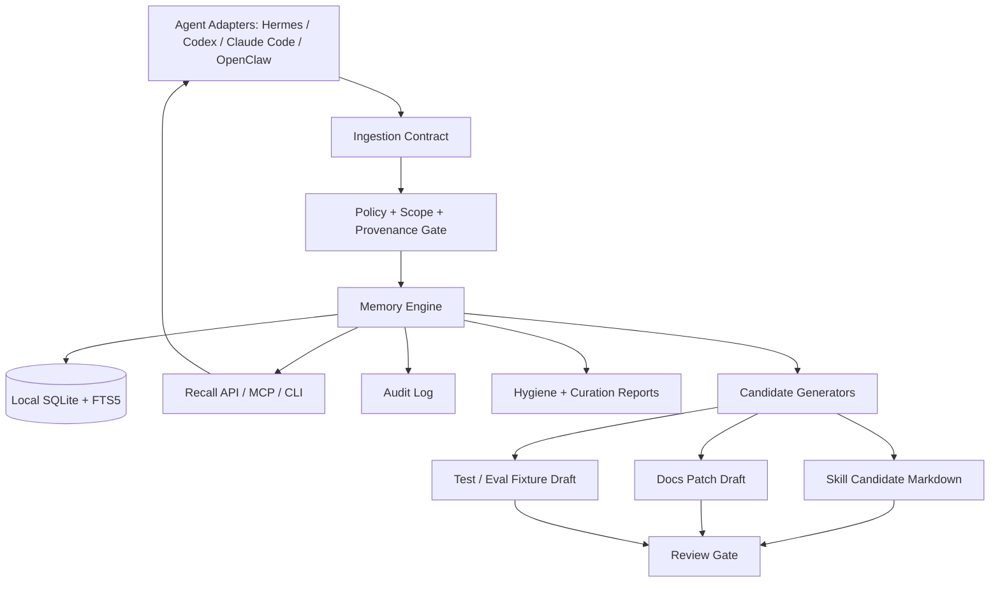

# Deep Memory Strategic Design

> Date: 2026-07-05
> Scope: Next-stage product/design plan for Deep Memory after competitor research and strategic narrowing.

## 1. Executive Summary

Deep Memory should not become another generic vector memory API. The sharper opportunity is to become the **local-first unified memory substrate for AI work agents**: Hermes, OpenClaw, Codex, Claude Code, OpenCode, Cursor/Windsurf, and future MCP-capable agents.

The product should emphasize three strategic pillars:

1. **Unified Memory Substrate** — one local, scoped, inspectable memory vault shared across multiple agents.
2. **Memory Governance / Audit / Curation** — automatic lifecycle control, evidence, conflict/staleness handling, inspect/export/delete, and memory hygiene.
3. **Memory → Skill / Docs / Tests Loop** — convert verified procedural memory into reviewable capability assets, not hidden behavioral drift.

The intended user is an individual or small-team agent power user who repeatedly moves across local AI coding/work agents and wants durable memory without cloud lock-in, raw transcript hoarding, or ungoverned hidden state.

## 2. Product Thesis

### 2.1 One-line positioning

> Deep Memory is a local-first long-term operational memory substrate for AI work agents, turning traceable agent experience into governed, auditable, reusable Skills / Docs / Tests.

### 2.2 Differentiation statement

```text
Mem0 remembers facts.
Graphiti/Zep remembers temporal relationships.
Letta remembers inside its own agent runtime.
Deep Memory remembers verified work across agents: decisions, failures, workflows, scopes, evidence, and skill candidates.
```

### 2.3 Non-goals

Deep Memory should not optimize for these first:

- hosted team memory cloud;
- generic vector database replacement;
- broad multimodal ingestion from PDFs/images/video/audio;
- automatic skill installation without review;
- per-memory manual approval for every low-risk record;
- raw transcript hoarding as the default ingestion model.

## 3. Design Principles

1. **Local-first by default**
   - The default source of truth is a local SQLite-backed vault.
   - Cloud sync, if ever added, must be optional and policy-bound.

2. **Agent-native, not app-specific**
   - Memory should work across Hermes, OpenClaw, Codex, Claude Code, OpenCode, Cursor/Windsurf, and MCP agents.
   - No single runtime should own the memory model.

3. **Automatic governance, not approval fatigue**
   - Default-safe memories should be automatically classified, scoped, merged, and lifecycle-managed.
   - Human interruption is reserved for high-risk, high-impact, low-confidence, sensitive, or conflicting records.

4. **Evidence-first durability**
   - Durable memories that steer future behavior should preserve source, confidence, timestamps, scope, and preferably verification evidence.

5. **Memory should become capability only through review**
   - Memory can suggest skill/docs/tests candidates.
   - It must not silently install behavior-changing skills into an agent profile.

6. **Scopes are product-critical**
   - Cross-agent memory is useful only if project/workspace/user/global boundaries are reliable.
   - Scope leakage is a P0 product failure.

## 4. Pillar A — Unified Memory Substrate

### 4.1 Goal

Make one local Deep Memory vault usable by many agents without forcing those agents to adopt one runtime.

### 4.2 User promise

> Teach once. Every local agent remembers, inside the right scope.

### 4.3 Core user story

As a developer using multiple local AI agents, I want a project convention learned by one agent to be recallable by another agent in the same project, so I do not need to repeat instructions and corrections across tools.

### 4.4 Target demo

```text
1. Claude Code or Codex writes a project-scoped procedural memory.
2. The memory is stored in the shared local Deep Memory DB.
3. Hermes or OpenClaw performs pre-task recall in the same repo.
4. The same memory is recalled and injected as compact context.
5. A different repo does not receive that memory.
6. The user can inspect the record, source agent, scope, and audit trail.
```

### 4.5 Functional requirements

- Shared DB path resolution:
  - machine default: `~/.deep-memory/deep-memory.db`;
  - optional project-local override: `.deep-memory/deep-memory.db`;
  - explicit adapter config override.
- Stable scope model:
  - `global`, `user`, `tenant`, `workspace`, `project`;
  - `scope_id` derived from repo root, git remote, configured project ID, or explicit adapter value.
- Agent identity tracking:
  - `source_agent`: `hermes`, `codex`, `claude-code`, `openclaw`, `opencode`, `cursor`, etc.
  - `origin_type`: explicit user fact, session summary, tool trace, project doc, verified workflow, correction.
- Adapter lifecycle hooks:
  - pre-task recall;
  - post-task extraction;
  - session-end summarization/import;
  - explicit memory write/search/delete commands.
- Compact context injection:
  - recall should return bounded, ranked, scoped snippets;
  - no raw transcript injection by default.

### 4.6 Interfaces

#### CLI

```bash
deep-memory agent recall --agent hermes --cwd "$PWD" --query "test command before review"
deep-memory agent import-facts --agent codex --scope project --scope-id <derived> facts.jsonl
deep-memory scope explain --cwd "$PWD"
```

#### MCP

```text
search_memory(query, scope, scope_id, agent_id)
add_memory(content, kind, scope, scope_id, source_agent, origin_type, evidence)
preview_write_policy(content, scope, scope_id)
export_memory_pack(scope, scope_id)
```

#### Adapter contract

```json
{
  "agent": "codex",
  "event": "post_task_extraction",
  "scope": "project",
  "scope_id": "github.com/org/repo",
  "observations": [
    {
      "kind": "procedural",
      "content": "Workflow: run uv run pytest -q before release review.",
      "confidence": 0.84,
      "importance": 0.78,
      "evidence": ["command: uv run pytest -q => passed"]
    }
  ]
}
```

### 4.7 Success criteria

- Cross-agent recall demo passes locally.
- Scope isolation test proves repo A memory does not leak into repo B.
- At least two adapters or adapter shims work against the same DB.
- User can inspect which agent wrote and which agent recalled a memory.

## 5. Pillar B — Memory Governance / Audit / Curation

### 5.1 Goal

Make long-term memory trustworthy over time by controlling write eligibility, scope, lifecycle, conflict, deletion, and evidence.

### 5.2 User promise

> Memory should be useful infrastructure, not invisible folklore.

### 5.3 Governance pipeline

```text
candidate input
  -> durability classification
  -> safety/risk filter
  -> scope inference
  -> duplicate/merge check
  -> conflict/staleness check
  -> confidence/importance assignment
  -> active / candidate / short-term / denied decision
  -> audit event
  -> recall usage observation
  -> hygiene report / export / delete / skill-doc-test promotion
```

### 5.4 Memory states

| State | Meaning | Recall behavior |
| --- | --- | --- |
| `working` | short-term, low-confidence context with TTL | not default durable recall |
| `candidate` | needs selective confirmation or review | excluded from default unless explicitly requested |
| `active` | durable memory allowed for scoped recall | included in default recall |
| `superseded` | replaced by newer memory | hidden from default, visible in audit/conflict views |
| `deprecated` | soft-deleted / no longer trusted | hidden from default, visible in audit |
| `hard_deleted` | physically removed | not visible except aggregate deletion audit if retained |

### 5.5 Risk classes

| Class | Default action | Examples |
| --- | --- | --- |
| Low-risk durable | auto-write | stable preferences, verified project conventions |
| Short-term / low-confidence | write with TTL | tentative task context, incomplete observation |
| Duplicate / mergeable | merge or reinforce | repeated same preference/convention |
| Conflict | candidate + alert | user changed preference, command replaced |
| High-impact behavior | candidate + review | global behavior policy, skill activation |
| Sensitive / private | deny or confirmation path | personal contact details, third-party private data |
| Secret / unsafe | deny | tokens, credentials, private keys, raw transcript dumps |

### 5.6 Audit model

Every durable write or lifecycle change should produce an audit event:

```json
{
  "event_id": "...",
  "memory_id": "...",
  "event_type": "write|merge|supersede|deprecate|delete|recall|export|skill_candidate",
  "actor": "agent:hermes|user|cli|webui|mcp",
  "source_agent": "codex",
  "scope": "project",
  "scope_id": "github.com/org/repo",
  "policy_decision": "allow|deny|requires_confirmation|short_term",
  "evidence_refs": ["tool:pytest:passed"],
  "timestamp": "2026-07-05T22:47:17+08:00"
}
```

### 5.7 Curation surfaces

Minimum viable curation should include:

- CLI memory hygiene report:
  - new records;
  - stale records;
  - duplicates;
  - conflicts;
  - risky candidate records;
  - records used frequently in recall;
  - records never used.
- Markdown export pack:
  - `MEMORY.md`;
  - `PROCEDURES.md`;
  - `PROJECT_RULES.md`;
  - `PREFERENCES.md`;
  - `CONFLICTS.md`;
  - `AUDIT_SUMMARY.md`.
- WebUI inspector later:
  - search/filter by scope/kind/source_agent/status;
  - edit/deprecate/delete;
  - conflict resolution;
  - evidence viewer;
  - skill candidate review.

### 5.8 Success criteria

- Unsafe writes are blocked across SDK, CLI, MCP, and adapter import paths.
- Low-risk memory writes do not require per-record user approval.
- Conflict test creates candidate/superseded state instead of silently overwriting.
- Hygiene report produces actionable markdown/CLI output.
- Delete/export behavior is verified by tests.

## 6. Pillar C — Memory → Skill / Docs / Tests Loop

### 6.1 Goal

Convert verified agent experience into durable capability assets: skill candidates, docs updates, regression tests, eval fixtures, and project playbooks.

### 6.2 User promise

> The agent should not only remember what happened; it should turn repeated verified work into reusable operating capability.

### 6.3 Closed loop

```text
agent session / tool trace
  -> extracted semantic/procedural memory
  -> evidence attachment
  -> recurrence/generalization scoring
  -> candidate generation
  -> review gate
  -> skill/docs/test/eval artifact
  -> future recall or activation
  -> usage/audit feedback
```

### 6.4 Artifact classes

| Source memory | Candidate artifact | Review gate |
| --- | --- | --- |
| L2 semantic: stable project convention | docs / project rule export | maintainer/user review |
| L3 episodic: failed attempt with evidence | regression test / troubleshooting note | test must reproduce or guard failure |
| L4 procedural: verified workflow | skill candidate markdown | skill review + safety check |
| repeated retrieval miss | eval fixture | eval must fail before improvement |
| conflict resolution | policy test / docs note | conflict handling verified |

### 6.5 Skill candidate invariant

Deep Memory may generate skill candidates, but must not auto-install them.

```text
memory -> candidate markdown -> reviewer gate -> normal skill installation path
```

This protects against hidden behavior drift.

The key product distinction is **generation vs activation**:

- **Generated candidate**: a reviewable artifact exists under a safe location such as `skill-candidates/`; it can be recalled, inspected, and suggested, but it does not change agent behavior by itself.
- **One-shot use**: when a future task strongly matches a candidate, the agent may ask to apply the candidate for this task only, without installing it globally.
- **Installed skill**: after explicit review/approval, the candidate is rewritten into the host agent's canonical skill format and installed through the normal skill-management path.

### 6.5.1 How candidates become useful without auto-install

A candidate should become useful through two low-friction surfaces:

1. **Batch curation** — hygiene reports or WebUI review show pending candidates with evidence and let the user accept/reject/promote them in a focused review session.
2. **Just-in-time suggestion** — pre-task recall detects that the current task matches a candidate and asks the user for a scoped action.

The just-in-time prompt should offer scoped choices, not a binary global install:

```text
I found a reviewed-looking skill candidate relevant to this task:
- candidate: kanban-protocol-recovery
- evidence: 2 successful recoveries, targeted tests passed
- scope: project github.com/org/repo

How should I use it?
1. Use once for this task only
2. Install for this project/profile after review
3. Keep as candidate and do not use now
4. Reject/archive candidate
```

Default behavior should be conservative: if the user is not present or no approval channel exists, the agent may cite the candidate as contextual memory but must not install it or silently treat it as an active skill.

### 6.5.2 When to ask the user

Do **not** ask immediately when every procedural memory is created. That creates approval fatigue.

Ask only at one of these moments:

- **Curation moment**: the user explicitly runs a hygiene report, opens the WebUI candidate review, or asks to improve skills/docs/tests.
- **Recurrence moment**: a new task strongly matches an existing candidate and the candidate would materially improve the next action.
- **Promotion moment**: a candidate has enough evidence and the system is about to move it from passive memory into active agent behavior.
- **Risk moment**: the candidate affects global behavior, security-sensitive workflows, destructive commands, credentials, privacy, or cross-project scope.

This means most candidates sit quietly as reviewable artifacts until either the user reviews them in batch or a future task makes them relevant.

### 6.5.3 Activation levels

| Level | State | User interaction | Effect |
| --- | --- | --- | --- |
| L0 | Procedural memory only | None | Can be retrieved as normal memory context. |
| L1 | Skill candidate generated | None or batch report | Candidate exists for review; no behavior change. |
| L2 | One-shot candidate use | Ask at recurrence moment | Agent follows candidate for this task only and reports evidence. |
| L3 | Project/profile skill install | Explicit approval/review | Skill becomes available to that project/profile. |
| L4 | Global skill install | Strong explicit approval | Skill can influence all matching future tasks. Use rarely. |

### 6.6 Candidate metadata

A generated candidate should include:

- source memory IDs;
- source agent and origin type;
- scope and scope_id;
- evidence summary;
- recurrence reason;
- safety boundary;
- stale/private data check;
- verification command or checklist;
- `auto_install: false`.

### 6.7 Success criteria

- Procedural memory can export a skill candidate with evidence.
- Candidate export rejects or redacts stale IDs, secrets, and one-off task state.
- At least one workflow produces docs/test/eval candidate, not only skill markdown.
- Review gate is explicit and test-covered.

## 7. Proposed Architecture



## 8. Implementation Tracks

### Track 1 — Substrate and adapters

- Define adapter event schema.
- Add agent identity and origin metadata if missing.
- Implement scope derivation/explain command.
- Build cross-agent demo across at least two local agents or shims.

### Track 2 — Governance and audit

- Centralize write policy across all write/import paths.
- Add audit event model.
- Add conflict/staleness lifecycle tests.
- Add hygiene report CLI/export.

### Track 3 — Capability promotion loop

- Extend procedural skill candidate export.
- Add docs/test/eval candidate generators.
- Add review-gate metadata and tests.
- Demonstrate one verified workflow becoming a candidate skill/docs/test bundle.

### Track 4 — Evaluation

- Cross-agent memory benchmark.
- Scope isolation benchmark.
- Governance safety benchmark.
- Memory→Skill candidate quality benchmark.
- Chinese mixed-token retrieval regression.

## 9. Open Questions

1. Which adapter should be the first public flagship: Hermes, Codex, Claude Code, or OpenClaw?
2. Should project scope ID default to git remote URL, repo root hash, package name, or explicit config?
3. Should audit events live in the same SQLite DB tables or append-only JSONL alongside DB?
4. How strong should automatic conflict detection be before introducing vector/embedding dependencies?
5. What is the minimum viable WebUI for governance: read-only inspector first, or edit/delete/conflict resolution from day one?
6. What review mechanism should skill/docs/test candidates use: human-only, model reviewer, or both?

## 10. Recommended First Milestone

The first milestone should prove the most differentiated wedge:

> A memory created from one agent is safely governed, scoped, audited, recalled by another agent, and then exported as a reviewable capability candidate when procedural and verified.

Minimum demo script:

1. Initialize shared DB.
2. Import a Codex/Claude-style post-task fact JSONL with a verified procedural memory.
3. Run policy/scope gate and write active memory.
4. Run Hermes/OpenClaw-style pre-task recall in same repo and show hit.
5. Run recall in different repo and show no hit.
6. Generate hygiene report.
7. Export procedural memory as skill candidate markdown with evidence.
8. Verify tests for scope isolation, policy gate, audit event, and skill candidate export.
